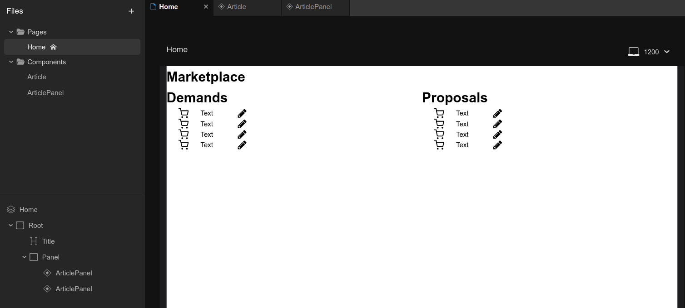

# 202312-ok-marketplace

Учебный проект курса
[Kotlin Backend Developer](https://otus.ru/lessons/kotlin/).
Поток курса 2023-12.

Marketplace -- это площадка, на которой пользователи выставляют предложения и потребности. Задача
площадки -- предоставить наиболее подходящие варианты в обоих случаях: для предложения -- набор вариантов с
потребностями, для потребностей -- набор вариантов с предложениями.

## Визуальная схема фронтенда

## Документация

1. Маркетинг и аналитика
    1. [Целевая аудитория](./docs/01-biz/01-target-audience.md)
    2. [Заинтересанты](./docs/01-biz/02-stakeholders.md)
    3. [Пользовательские истории](./docs/01-biz/03-bizreq.md)
2. Аналитика:
    1. [Функциональные требования](./docs/02-analysis/01-functional-requiremens.md)
    2. [Нефункциональные требования](./docs/02-analysis/02-nonfunctional-requirements.md)
3. DevOps
    1. [Файлы сборки](./deploy)
4. Архитектура
    1. [ADR](./docs/04-architecture/01-adrs.md)
    2. [Описание API](./docs/04-architecture/02-api.md)
    3. [Компонентная схема](./docs/04-architecture/03-arch.md)
5. Тесты

# Структура проекта

## Подпроекты для занятий по языку Kotlin

1. Модуль 1: Введение в Kotlin
    1. [m1l1-first](lessons/m1l1-first) - Вводное занятие, создание первой программы на Kotlin
    2. [m1l2-basic](lessons/m1l2-basic) - Основные конструкции Kotlin
    3. [m1l3-func](lessons/m1l3-func) - Функциональные элементы Kotlin
    4. [m1l4-oop](lessons/m1l4-oop) - Объектно-ориентированное программирование
    5. [m1l5-dsl](lessons/m1l5-dsl) - Предметно ориентированные языки (DSL)
2. Модуль 2: Расширенные возможности Kotlin
    1. [m2l1-coroutines](lessons/m2l1-coroutines) - Асинхронное и многопоточное программирование с корутинами
    2. [m2l2-flows](lessons/m2l2-flows) - Асинхронное и многопоточное программирование с Flow
    3. [m2l3-kmp](lessons/m2l3-kmp) - Kotlin Multiplatform
    4. m2l4 - Интероперабельность Котлин с другими языками
        1. [m2l4-1-interop](lessons/m2l4-1-interop) - Kotlin JS/Kotlin Native
        2. [m2l4-2-rust](lessons/m2l4-2-rust) - Kotlin-Rust
        3. [m2l4-3-jni](lessons/m2l4-3-jni) - Kotlin JVM - Native (JNI)
    5. [m2l5-gradle](lessons/m2l5-gradle) - Расширенные возможности Gradle, Kotlin DSL

## Проектные модули

## Мониторинг и логирование

1. [deploy](deploy) - Инструменты мониторинга и деплоя
2. [ok-marketplace-lib-logging-common](ok-marketplace-libs/ok-marketplace-lib-logging-common) - Общие объявления для
   логирования
3. [ok-marketplace-lib-logging-kermit](ok-marketplace-libs/ok-marketplace-lib-logging-kermit) - Библиотека логирования
   на базе библиотеки
   Kermit
4. [ok-marketplace-lib-logging-logback](ok-marketplace-libs/ok-marketplace-lib-logging-logback) - Библиотека логирования
   на базе библиотеки Logback
5. [ok-marketplace-lib-logging-socket](ok-marketplace-libs/ok-marketplace-lib-logging-socket) - Библиотека логирования
   на базе TCP-сокетов

### Транспортные модели, API

1. [specs](specs) - описание API в форме OpenAPI-спецификаций
2. [ok-marketplace-api-v1-jackson](ok-marketplace-be/ok-marketplace-api-v1-jackson) - Генерация первой версии
   транспортных модеелй с Jackson
3. [ok-marketplace-api-v1-mappers](ok-marketplace-be/ok-marketplace-api-v1-mappers) - Мапер между внутренними моделями и
   моделями API v1
4. [ok-marketplace-api-v2-kmp](ok-marketplace-be/ok-marketplace-api-v2-kmp) - Генерация второй версии транспортных
   моделей с KMP, там же расположены маперы
5. [ok-marketplace-api-log1](ok-marketplace-be/ok-marketplace-api-log1) - Генерация первой версии моделей логирования
   вместе с маперами
6. [ok-marketplace-common](ok-marketplace-be/ok-marketplace-common) - модуль с общими классами для модулей проекта. В
   частности, там
   располагаются внутренние модели и контекст.

## Фреймворки и транспорты

1. [ok-marketplace-app-spring](ok-marketplace-be/ok-marketplace-app-spring) - Приложение на Spring Framework
2. [ok-marketplace-app-ktor](ok-marketplace-be/ok-marketplace-app-ktor) - Приложение на Ktor JVM/Native
3. [ok-marketplace-app-rabbit](ok-marketplace-be/ok-marketplace-app-rabbit) - Микросервис на RabbitMQ
4. [ok-marketplace-app-kafka](ok-marketplace-be/ok-marketplace-app-kafka) - Микросервис на Kafka

## Модули бизнес-логики

1. [ok-marketplace-stubs](ok-marketplace-be/ok-marketplace-stubs) - Стабы для ответов сервиса
3. [ok-marketplace-biz](ok-marketplace-be/ok-marketplace-biz) - Модуль бизнес-логики приложения: обслуживание стабов,
   валидация, работа с БД
